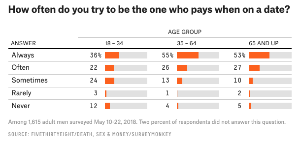

```{r setup, include=FALSE}
knitr::opts_chunk$set(echo = TRUE, error = TRUE)
library(tidyverse)
library(fivethirtyeight)   # contains  masculinity data set we'll use
data("masculinity_survey") # load data
```


Let's see if we can recreate that graphic showing response percentages for who pays on a date by age group.



## Wrangling review
Here is (approximately) where you should have ended up at the end of our last wrangling session

```{r}
date_q <- masculinity_survey %>%
  filter(question == "How often do you try to be the one who pays when on a date?") %>%
  select(response, contains("age")) %>%
  pivot_longer(-response, names_to = "age", values_to = "percent") %>%
  mutate(response = fct_relevel(response, "No answer", "Never", "Rarely", "Sometimes", "Often", "Always")) %>%
  mutate(age = as_factor(age)) %>%
  mutate(age = fct_recode(age, "18-34" = "age_18_34", "35-64" = "age_35_64", "65 AND UP" = "age_65_over"))
```

## Getting fancy with ggplot2

Now, we're going to try to recreate that graphic. 

```{r}
# Start the initial template
date_q %>% # using the pipe notation, the data will get inherited in following statements
  ggplot(aes(y = response, x = percent))
```

```{r}
# add a geom to get a bar plot
date_q %>%
  ggplot(aes(y = response, x = percent)) +
  geom_bar(stat = "identity") 

# 'percent' is not a true variable, but a total percent for each response, we need to specify that this value
# represents how long the bars should be with `stat = "identity"`
```

```{r}
# split the bar plot by age groups and drop the 'No answer' category
date_q %>%
  filter(response != "No answer") %>% # you can wrangle data right into a ggplot!
  ggplot(aes(y = response, x = percent)) +
  geom_bar(stat = "identity") +
  facet_grid(~age)
```

```{r}
# Change color and add labels
date_q %>%
  filter(response != "No answer") %>%
  ggplot(aes(y = response, x = percent)) +
  geom_bar(stat = "identity", fill = "darkorange2", width = 0.5) +
  facet_grid(~age) +
  labs(
    title = "How often do you try to be the one who pays when on a date?",
    subtitle = "AGE GROUP",
    x = "PERCENT",
    y = "ANSWER",
    caption = "Among 1,615 adult men surveyed May 10-22, 2018. Two percent of respondents did not answer this question.\nSOURCE: FIVETHIRTYEIGHT/DEATH, SEX & MONEY/SURVEYMONKEY"
  ) + # '\n' allows for new lines of text
  xlim(c(0, 1)) # this sets the x-axis from 0 to 1

```


```{r}
# To get really fancy, you can play with different themes, add text, and suppress background or axis markers
# There's almost no limit to what you can adjust, but it quickly gets complex
date_q %>%
  filter(response != "No answer") %>%
  ggplot(aes(y = response, x = percent)) +
  facet_grid(~age) +
  geom_bar(stat = "identity", fill = "darkorange2", width = 0.5) +
  geom_text(aes(label = percent * 100, x = 0),
    hjust = 1.5,
    color = "black", size = 4
  ) +
  theme_minimal() +
  labs(
    title = "How often do you try to be the one who pays when on a date?",
    subtitle = "AGE GROUP",
    caption = "Among 1,615 adult men surveyed May 10-22, 2018. Two percent of respondents did not answer this question.\nSOURCE: FIVETHIRTYEIGHT/DEATH, SEX & MONEY/SURVEYMONKEY"
  ) +
  xlim(c(0, 1)) +
  theme(
    panel.grid.major = element_blank(), panel.grid.minor = element_blank(),
    axis.text.x = element_blank(), axis.ticks = element_blank(), aspect.ratio = 2 / 3,
    axis.text.y = element_text(hjust = 0),
    axis.title.y = element_blank(),
    axis.title.x = element_blank(),
    strip.text.x = element_text(hjust = 0.5),
    plot.subtitle = element_text(hjust = 0.5),
    plot.caption = element_text(hjust = 0)
  ) +
  coord_cartesian(xlim = c(-1, 1), clip = "off")
```


To learn more about customizing `ggplot2` graphics, try the [R Graphics Cookbook](https://r-graphics.org/)